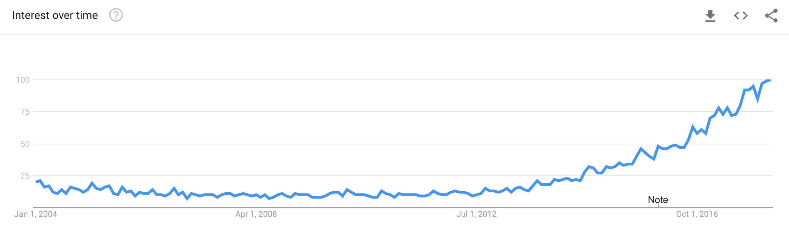

```{r setup, include=FALSE}
knitr::opts_chunk$set(echo = FALSE)
```
## About Me

- Hui Lin, Data Scientist (http://scientistcafe.com)
- Contact：
    - Email：longqiman@gmail.com
    - Twitter：[\@gossip_rabbit](https://twitter.com/gossip_rabbit)
    - LinkedIn：https://www.linkedin.com/in/hui-lin-81653855/
    
## Outline

- Slides: http://scientistcafe.com/IDS/slides/IntroToDataScience.html
- What is marketing data science? What value can data science bring?
- Predictive Analytics: parametric model and ensemble method
- Unstructured data analytics: digital marketing
- Market research analytics
- Case Study: Group Lasso Logistic Regression for Customer Retention
- Data Scientist Skill Set & How can you get in?

## 



## What is data science? 


## Predictive Analytics: parametric model and ensemble method

## Unstructured data analytics: digital marketing

## Market research analytics

## Case Study: Group Lasso Logistic Regression for Customer Retention

## Be a data scientist!