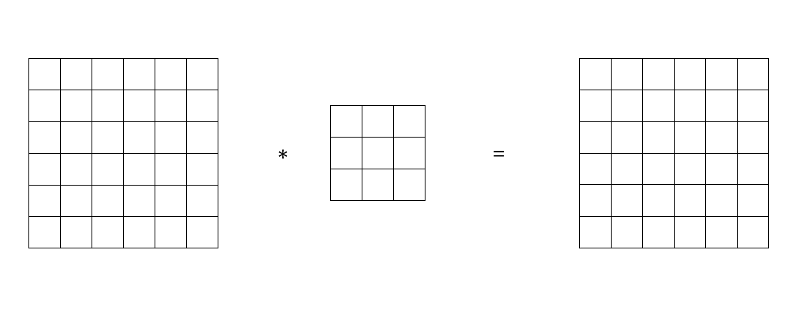

```{r setup, include=FALSE}
knitr::opts_chunk$set(echo = FALSE)
```

## Neural Network Basic

## Image Data

## Computer vision

- Image Classification

{width=60%}


## Computer vision

- Object Detection

{width=60%}

## Computer Vision

- Neural Style Transfer

{width=60%}

## Convolutions Schematic

<center>

</center>

## Edge Detection

{width=60%}

## Vertical Edge Detection

{width=60%}


## Padding

- Pad so that output size is the same as the input size.

{width=60%}

## Convolutions Over Volume

## One Layer of a Convolutional Network

## Pooling Layers

## Estimation

<center>

</center>