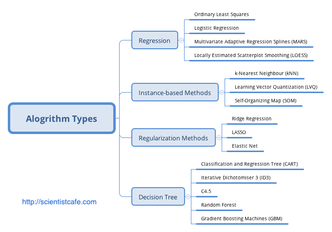
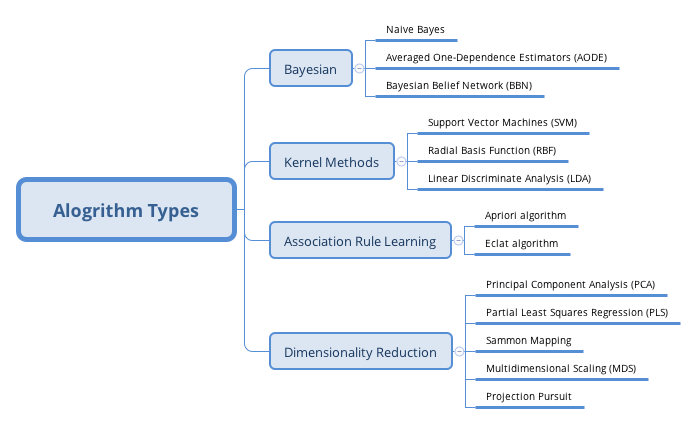
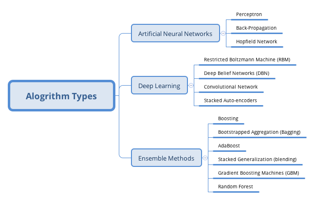

```{r setup, include=FALSE}
knitr::opts_chunk$set(echo = FALSE)
```

## Outline

- Slides: http://scientistcafe.com/IDS/slides/IntroToDataScience.html
- What is data science? Some definitions
- Brief history
- What questions can data science answer? 
- Types of Learning
- Types of Algorithm
- Data Scientist Skill Set
- Data Science Pipeline

## 


## What is data science?


## What is data science?

- Does big data matter?
- Back to 1962, John Tukey wrote in “The Future of Data Analysis”:

> For a long time I have thought I was a statistician, interested in inferences from the particular to the general. But as I have watched mathematical statistics evolve, I have had cause to wonder and to doubt. … All in all, I have come to feel that my central interest is in data analysis, which I take to include, among other things: procedures for analyzing data, techniques for interpreting the results of such procedures, ways of planning the gathering of data to make its analysis easier, more precise or more accurate, and all the machinery and results of (mathematical) statistics which apply to analyzing data.

## What is data science?

- The web site for DSI gives us an idea what Data Science is:

> “This coupling of scientific discovery and practice involves the collection, management, processing, analysis, visualization, and interpretation of vast amounts of heterogeneous data associated with a diverse array of scientific, translational, and interdisciplinary applications.”

## What is data scientist?

```{r, out.width = "850px",out.height = "400px"}
knitr::include_graphics("images/datascientist.png")
```

## What is data scientist?

Here is a list of definitions for a “data scientist”:

- “A data scientist is a data analyst who lives in California”
- “A data scientist is someone who is better at statistics than any software engineer and better - at software engineering than any statistician.”
- “A data scientist is a statistician who lives in San Francisco.”
- “Data Science is statistics on a Mac.”

## %&^%$*(^).....

- You know it when you see it.

{width=40%}

## Brief History

<center>
{width=90%}
</center>

## Driving Forces

- John Tukey identified 4 forces driving data analysis (there was no “data science” then):

1. The formal theories of math/stat 
1. Acceleration developments in computers and display devices 
1. The challenge, in many fields, of more and ever larger bodies of data 
1. The emphasis on quantification in an ever wider variety of disciplines 

## What questions can data science answer? 

- Specific
    1. How can we increase sales?
    1. Dose the January campaign on product X increase the amount of purcahse from our 2017 retained customers? 

- Data
    1. Representative
    1. Relevant
    1. Quality

## Types of Questions

<center>
{height=55%}
</center>


## Types of Learning

<center>
{height=100%}
</center>

## Types of Algorithm (1) 

- http://scientistcafe.com/2017/07/08/MachineLearningAl.html

<center>
{height=100%}
</center>


## Types of Algorithm (2)

- http://scientistcafe.com/2017/07/08/MachineLearningAl.html

<center>
{height=100%}
</center>

## Types of Algorithm (3)

- http://scientistcafe.com/2017/07/08/MachineLearningAl.html

<center>
{height=100%}
</center>

## Data Scientist Skill Set

{width=100%}


## General Process 

{width=100%}

## Automatic Data Science Pipeline

{width=100%}

## Some links

- [Types of Machine Learning Algorithm](http://scientistcafe.com/2017/07/08/MachineLearningAl.html)

- Online books:
    - [The Elements of Statistical Learning](http://web.stanford.edu/~hastie/ElemStatLearn/)
    - [An Introduction to Statistical Learning](http://www-bcf.usc.edu/~gareth/ISL/)
    - [Introduction to Data Science](http://scientistcafe.com/IDS/)(still writing)

- Hard copy books:
    - [Applied Predictive Modeling](http://appliedpredictivemodeling.com)
    - [R for Marketing Research and Analytics](http://r-marketing.r-forge.r-project.org)
    - [套路！机器学习](http://scientistcafe.com/book/)

- [Awesome-Data-Science-Materials](https://github.com/happyrabbit/Awesome-Data-Science-Materials)
