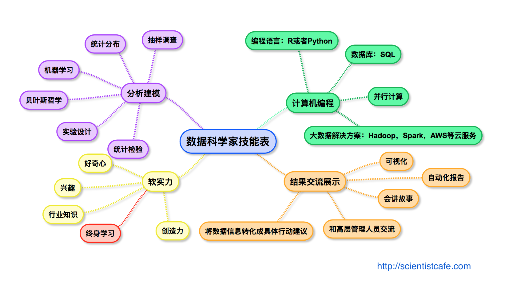

```{r setup, include=FALSE}
knitr::opts_chunk$set(echo = FALSE)
```

## 关于我

- 专业背景：http://scientistcafe.com/cv.pdf
- 联系方式：
    - Email：longqiman@gmail.com
    - Twitter：[\@gossip_rabbit](https://twitter.com/gossip_rabbit)
    - LinkedIn：https://www.linkedin.com/in/hui-lin-81653855/

## 数据链全景图

{width=100%}

## 数据科学家技能图

{width=100%}


## 算法类型 (1) 

- http://scientistcafe.com/2017/07/08/MachineLearningAl.html

<center>
{height=100%}
</center>

## 算法类型 (2)

- http://scientistcafe.com/2017/07/08/MachineLearningAl.html

<center>
{height=100%}
</center>

## 算法类型 (3)

- http://scientistcafe.com/2017/07/08/MachineLearningAl.html

<center>
{height=100%}
</center>

## 如何获取相关技能

- 大学研究生教育

- MOOC

- 讲座和会议

## 数据科学的坑

- 会用函数跑模型就可以了。

- 模型精确度越高越好。

- 技术过硬就是尚方宝剑。

- 不明觉厉。

## 数据科学学习资源

- [Types of Machine Learning Algorithm](http://scientistcafe.com/2017/07/08/MachineLearningAl.html)

- 在线书：
    - [The Elements of Statistical Learning](http://web.stanford.edu/~hastie/ElemStatLearn/)
    - [An Introduction to Statistical Learning](http://www-bcf.usc.edu/~gareth/ISL/)
    - [Introduction to Data Science](http://scientistcafe.com/IDS/)(still writing)

- 纸质书:
    - [Applied Predictive Modeling](http://appliedpredictivemodeling.com)
    - [R for Marketing Research and Analytics](http://r-marketing.r-forge.r-project.org)
    - [套路！机器学习](http://scientistcafe.com/book/)

- [Awesome-Data-Science-Materials](https://github.com/happyrabbit/Awesome-Data-Science-Materials)
